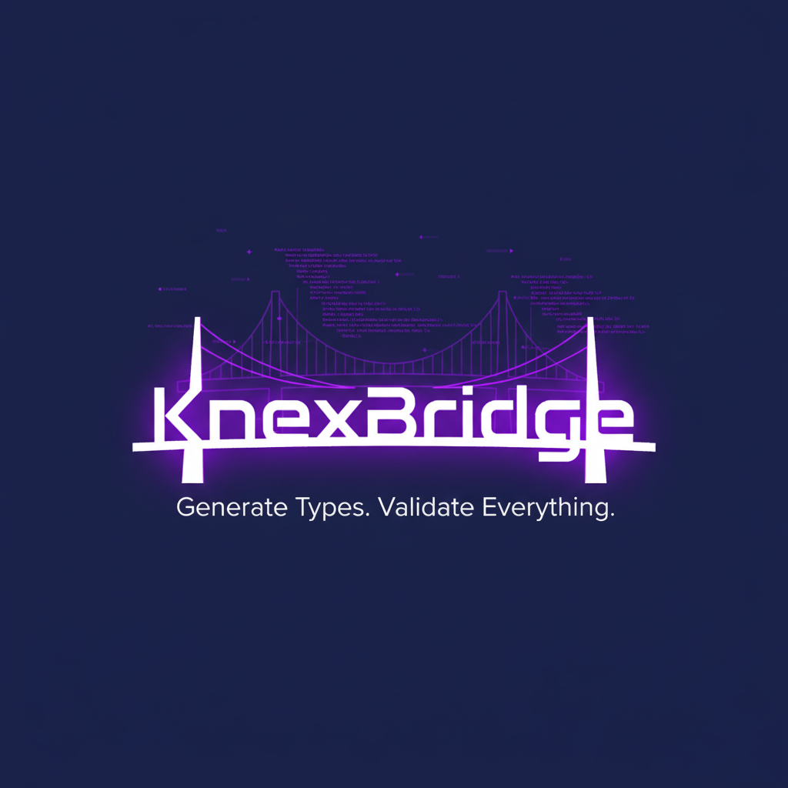
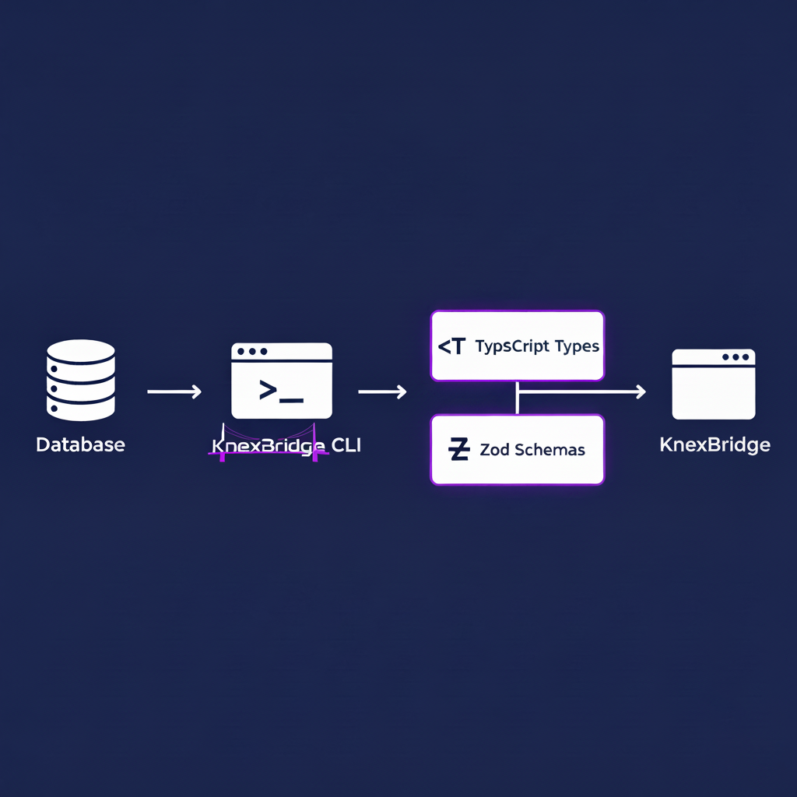
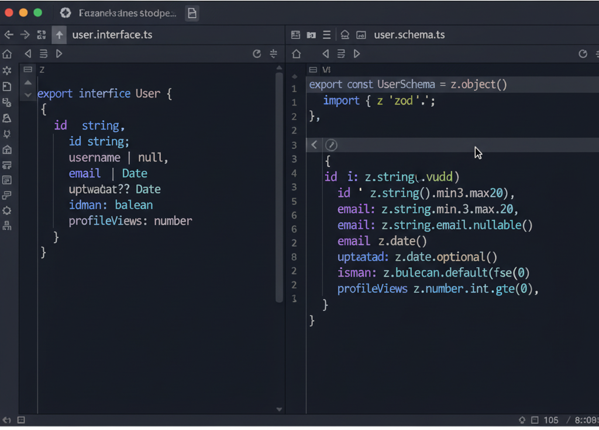
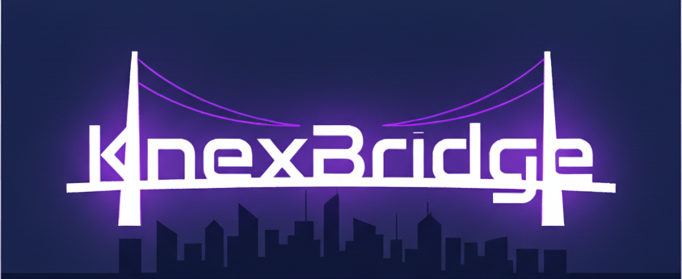

# KnexBridge

    

## Generate Types. Validate Everything.

KnexBridge bridges relational databases and TypeScript applications by introspecting your schema, generating fully typed models, and producing runtime validation assets. It is designed for teams that rely on Knex.js for migrations and queries but want stronger guarantees across API layers, services, and front-end clients.

## Introduction
\n\n## Why KnexBridge\n- Eliminates schema drift by regenerating types and validators every time your schema changes.\n- Provides runtime security through Zod contracts that mirror your database, catching malformed payloads before they hit storage.\n- Keeps teams in sync by producing canonical models that front-end, back-end, and data pipelines can share.

## Features
- Database introspection for SQLite, PostgreSQL, and MySQL today (SQL Server on the roadmap).
- TypeScript interface generation with configurable naming strategies and relation helpers.
- Automatic Zod schema creation for request validation and shared contracts.
- Insert and update helper types that respect excluded columns and defaults.
- Customizable type mappings and surfacing of warnings for unmapped columns.
- CLI workflow with progress reporting, metrics, and optional configuration files.

## Installation
`ash
npm install --save-dev knexbridge
npm install knexbridge-core
`

## Quick Start
1. Create a knexfile.js describing your Knex environments:

   `javascript
   /** @type {import('knex').Knex.Config} */
   module.exports = {
     development: {
       client: 'sqlite3',
       connection: {
         filename: './dev.sqlite',
       },
       useNullAsDefault: true,
     },
   };
   `

2. Generate code into a target folder:

   `ash
   npx knexbridge generate --config ./knexfile.js --env development --out ./generated
   `

3. Import the generated modules from your application:

   `	ypescript
   import { bridge } from './generated';
   `

## Example Output
`	ypescript
// generated/bridge.schema.ts
export interface User {
  id: number;
  username: string;
  email?: string | null;
  createdAt: Date;
}

export type UserInsert = Pick<User, 'username' | 'email'>;
export type UserUpdate = Partial<Pick<User, 'username' | 'email'>>;
`

`	ypescript
// generated/bridge.validation.ts
import { z } from 'zod';

export const UserSchema = z.object({
  id: z.number(),
  username: z.string().min(1),
  email: z.string().email().nullable(),
  createdAt: z.date(),
});
`

### Verified Demo
- ? Tested on Node 18+ with SQLite using:
  `ash
  npm install --save-dev knexbridge knexbridge-core
  npx knexbridge generate --config ./knexfile.js --out ./generated
  `

## Development
`ash
npm install
npm run build
npm run test
`
- 
pm run build compiles the core and CLI packages.
- 
pm run test performs type-level smoke tests across the workspace.

## Roadmap
- Add PostgreSQL, MySQL, and SQL Server dialect support with driver autodetection.
- Generate relation-aware helper functions and query builders.
- Provide plugin hooks for custom template outputs (tRPC, OpenAPI, etc.).
- Publish official VS Code snippets and typed SDK examples.

## Contributing

### Code of Conduct
All contributors are expected to follow the [Contributor Covenant Code of Conduct](https://www.contributor-covenant.org/version/2/1/code_of_conduct/). Be respectful, constructive, and professional at all times.

### Getting Started
1. **Fork and Clone**

   `ash
   git clone https://github.com/<your-username>/KnexBridge.git
   cd KnexBridge
   npm install
   `

2. **Build the Packages**

   `ash
   npm run build
   `

3. **Run the CLI Locally**

   `ash
   node packages/cli/dist/cli.js generate --config ./knexfile.js --out ./generated
   `

4. **Test**

   Run all tests before submitting changes:

   `ash
   npm test
   `

### Branching & Commits
- Create a new branch for each change:

  `ash
  git checkout -b feature/add-postgres-support
  `

- Use conventional commits (eat:, ix:, chore:, docs:).
- Keep commits atomic and messages clear.

### Pull Requests
- Ensure your code builds with no TypeScript errors.
- Run linting before pushing:

  `ash
  npm run lint
  `

- Include tests for new features.
- Update documentation (README, comments, etc.) when behavior changes.
- Open a PR against the main branch and describe why the change matters.

### Issue Guidelines
- **Bug reports:** include reproduction steps, environment details, and relevant logs.
- **Feature requests:** explain the use case and proposed API or CLI syntax.
- **Discussions:** use the GitHub Discussions tab for design ideas or roadmap suggestions.

### Development Notes
- Node.js >= 18.18.0 is required.
- Linting configuration lives in .eslintrc.json.
- Core logic is under packages/core/src/.
- CLI code lives in packages/cli/src/.

## License
Licensed under the [MIT License](./LICENSE).

